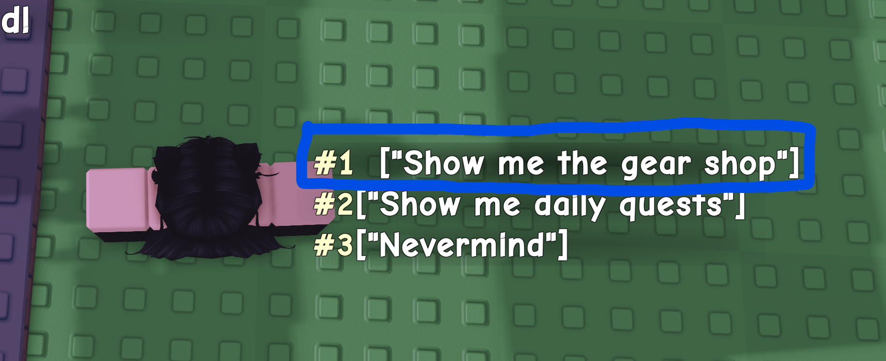
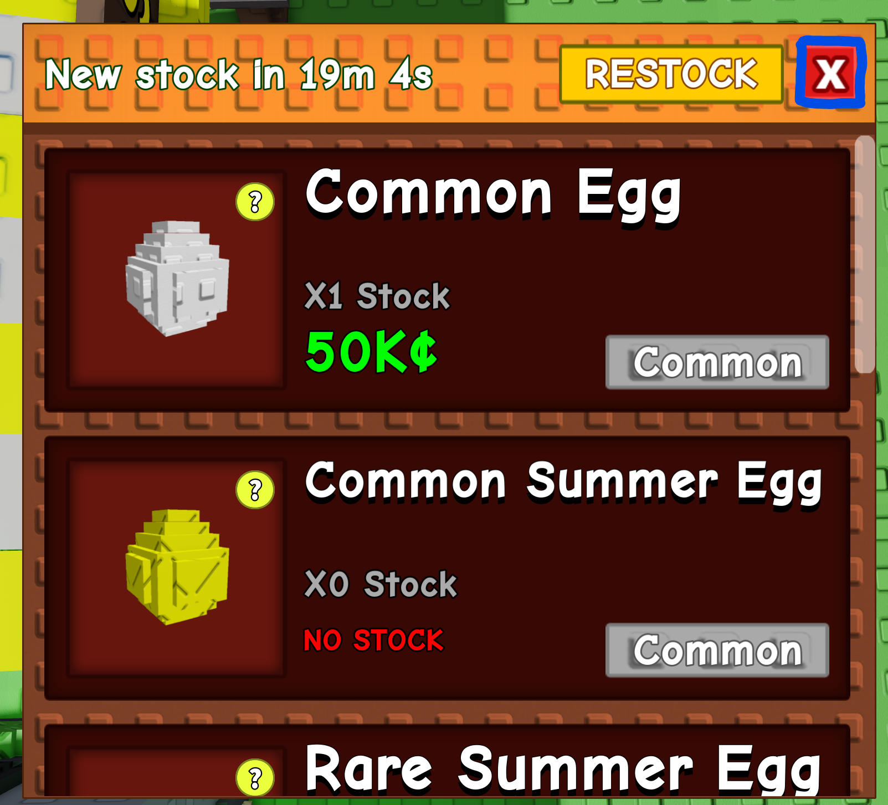

This is a macro for the hit Roblox game Grow a Garden.
# How to Use
1. Make sure that AutoHotKey version 2.0 is installed on your computer. You can download it from [here](https://www.autohotkey.com/).
2. Run `main.ahk`.
3. Make sure that shiftlock is set to **off** and your camera mode is set to **Default (Classic)** and your movement mode is **Default (Keyboard)**.
4. The Recall Wrench should be in your **2nd** hotbar slot, and should not be equipped. The macro will automatically equip it when needed.
5. In order to run the macro, make sure that you click the "Set Config" button and follow the directions on-screen. This needs to be done only once, but can be done as many times as you want. This allows for certain variables to be set that cannot normally be changed by the user via the UI. **YOU DO NOT NEED TO CLICK "SET CONFIG" IN ORDER TO SET THE BUY OPTIONS FOR THE MACRO.**
# Features
* Automatically buys seeds, gear, and eggs (duh)
* Automatic character alignment
* Automatic camera alignment
* Failsafe checks to ensure that the macro does not run when it shouldn't
## Failsafes
This macro has several failsafes to ensure that it does not run when it shouldn't. For each enabled failsafe, the macro will scan the screen for certain text for a certain number of times before terminating. If the text is found for more than half of the scans, the macro will terminate. Failsafes are checked at the beginning of each macro sequence (so every `shop_timer` interval).
# settings.ini
* `kill_key`: The key to press to stop the macro. Default is `F6`.
* `show_tooltips`: Whether to show tooltips in the UI. Default is `true`.
* `window_failsafe`: When enabled, the macro will terminate if Roblox is not the focused window. Default is `true`.
* `internet_failsafe`: When enabled, the macro will terminate if disconnected from the internet. Default is `true`.
* `shutdown_failsafe`: When enabled, the macro will terminate if the server shuts down. Default is `true`.
* `other_failsafe`: When enabled, the macro will terminate if the player is disconnected from the server for any other reason. Default is `true`.
* `shop_timer`: Time between checks of the seed and gear shops. Default is every `300` seconds since midnight.
* `failsafe_scan_count`: Number of times to scan the screen for failsafe text. Default is `10`.
* `egg_timer`: Time between egg checks. Default is every `1800` seconds since midnight.
* `grace`: Seconds between pressing the start button and the macro actually starting. Default is `5` seconds.
# Config setup
* The config setup is done by clicking the "Set Config" button in the UI, and it must bedone before your first run of the macro. If not done, the macro will let you know and it will not run.
* These are the points that the macro will ask you for:
* **Note**: click anywhere inside of the rectangles in the images

| Name                    | Image                                                                              | 2nd Image                                                           |
|-------------------------|------------------------------------------------------------------------------------|---------------------------------------------------------------------|
| `seed_shop_button`      |                 |                                                                     |
| `seed_shop_exit_button` |  |                                                                     |
| `garden_button`         |                          |                                                                     |
| `sell_button`           |                                |                                                                     |
| `gear_enter_point`      |                 |                                                                     |
| `gear_shop_exit_button` |  |                                                                     |
| `egg_buy_button`        |                 |  |
| `egg_shop_exit_button`  |     |                                                                     |

# Tips
* I would **HEAVILY SUGGEST** sitting by your computer while the macro runs its first run, just to make sure that it works as intended.
# Keep in Mind
* The macro may not force close itself on `kill_key` press if it is pressed during set up. This is why `window_failsafe` is enabled by default.
